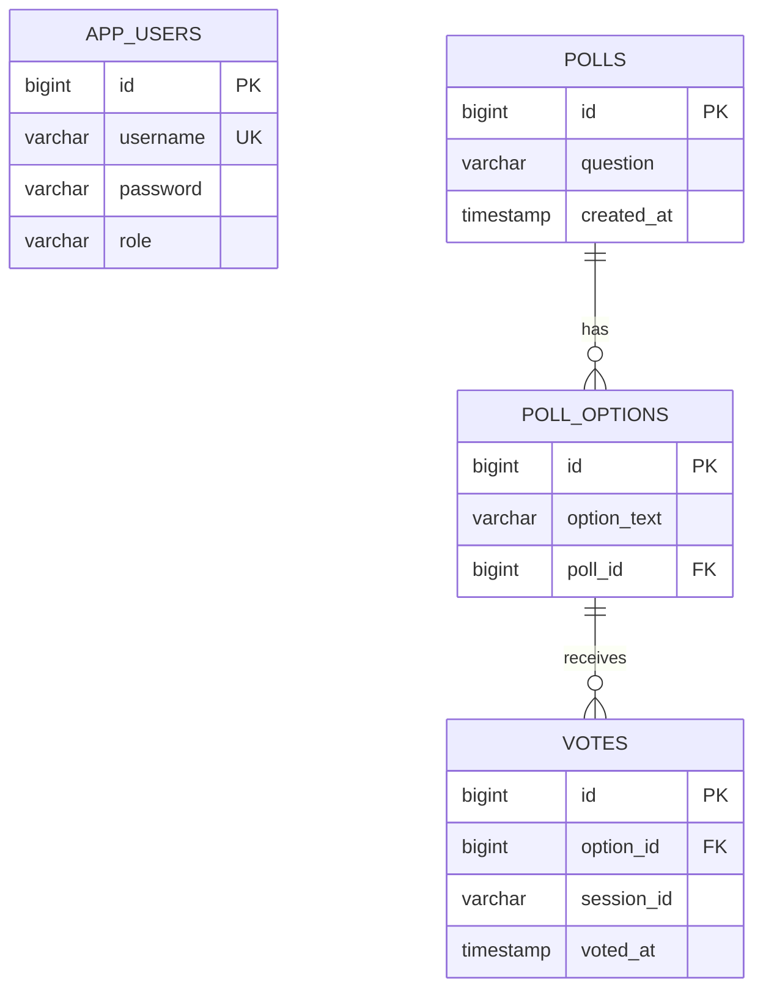

# Voting App

A full-stack polling application built with Spring Boot and Angular. Admins can create, edit, and delete polls. Anyone can view polls and vote (one per session per poll).

## Tech Stack

- **Backend:** Java 21, Spring Boot 3.4, Spring Security, Spring Data JPA, PostgreSQL, SpringDoc OpenAPI (Swagger)
- **Frontend:** Angular 17, Bootstrap 5, TypeScript
- **Auth:** Session-based with BCrypt password hashing
- **Vote limiting:** Session/cookie-based (one vote per browser session per poll)

## Quick Start

> **Note:** Docker requires [Docker Desktop](https://www.docker.com/products/docker-desktop/) on macOS and Windows. On Linux, the Docker Engine alone is sufficient.

```bash
docker compose up --build
```

Open [http://localhost:8080](http://localhost:8080). Postgres, the backend, and the frontend all start automatically.

To stop everything:
```bash
docker compose down        # keeps database data
docker compose down -v     # wipes database data
```

## Default Admin Account

| Username | Password |
|----------|----------|
| `admin`  | `admin123` |

Seeded automatically on first startup.

## API Documentation (Swagger)

Interactive API docs are available at [http://localhost:8080/swagger-ui.html](http://localhost:8080/swagger-ui.html) when the backend is running. You can try out all endpoints directly from the browser.

The raw OpenAPI spec is at `/v3/api-docs`.

### Postman Collection

Import `postman/Voting_App_API.postman_collection.json` into Postman to get all endpoints pre-configured with test scripts. The collection is organized into folders (Auth, Polls, Voting, Error Cases) and uses variables so IDs flow automatically — run **Login** first, then **Create Poll**, and the `pollId`/`optionId` variables are set for all subsequent requests.

## API Endpoints

| Method | Endpoint | Auth | Description |
|--------|----------|------|-------------|
| `POST` | `/api/auth/login` | Public | Login |
| `POST` | `/api/auth/logout` | Public | Logout |
| `GET` | `/api/auth/me` | Public | Current user info |
| `GET` | `/api/polls` | Public | List all polls |
| `GET` | `/api/polls/{id}` | Public | Get poll with vote counts |
| `POST` | `/api/polls` | Admin | Create poll |
| `PUT` | `/api/polls/{id}` | Admin | Update poll |
| `DELETE` | `/api/polls/{id}` | Admin | Delete poll |
| `POST` | `/api/polls/{id}/votes` | Public | Cast vote |

## Running Tests

```bash
# Backend (uses H2 in-memory DB — no Postgres needed)
./mvnw test

# Frontend (Jest)
cd voting-ui && npm test
```

### Test Coverage

```bash
# Backend — generates HTML report at target/site/jacoco/index.html
./mvnw test
open target/site/jacoco/index.html

# Frontend — generates HTML report at voting-ui/coverage/index.html
cd voting-ui && npm run test:coverage
open coverage/index.html
```

## Project Structure

```
├── src/main/java/com/example/voting/
│   ├── config/          # Security, CORS, data seeder, SPA forwarding
│   ├── controller/      # REST controllers (Auth, Poll)
│   ├── dto/             # Request/response objects
│   ├── entity/          # JPA entities (Poll, PollOption, Vote, AppUser)
│   ├── exception/       # Error handling
│   ├── repository/      # Spring Data repositories
│   └── service/         # Business logic
├── voting-ui/src/app/
│   ├── components/      # Angular components (login, navbar, polls, etc.)
│   ├── guards/          # Route guards (admin)
│   ├── models/          # TypeScript interfaces
│   └── services/        # HTTP services (auth, poll)
├── docker-compose.yml   # One-command full stack
├── Dockerfile           # Multi-stage build
└── pom.xml
```

## Data Model



## Design Decisions

- **Separate votes table** with session tracking for duplicate prevention
- **Session/cookie-based vote limiting** via `HttpSession` — no user registration required to vote
- **PostgreSQL** for persistent data (H2 kept for fast tests)
- **Admin-only write operations** — Spring Security protects create/edit/delete endpoints
- **CORS + proxy config** — relative API URLs work in both dev (ng serve proxy) and production (single Docker container)
